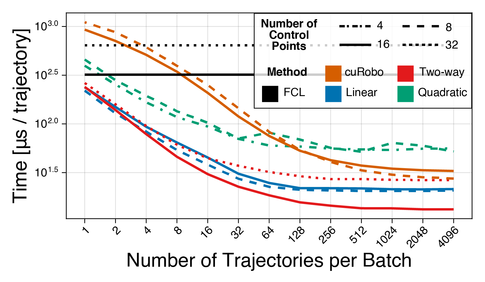

# RTCollisionDetection

RTCollisionDetection implements high-performance mesh-to-mesh and mesh-to-swept-volume collision detection using [NVIDIA OptiX](https://developer.nvidia.com/rtx/ray-tracing/optix). This package supports both discrete and continuous collision detection for robot motion planning, leveraging GPU ray tracing for scalability and accuracy.

<div align="center">

<table>
  <tr>
    <td></td>
    <td></td>
    <td></td>
    <td></td>
  </tr>
  <tr>
    <td align="center">(a)</td>
    <td align="center">(b)</td>
    <td align="center">(c)</td>
    <td align="center">(d)</td>
  </tr>
</table>

<p align="center">
  <em>Ray tracing collision detection methods: discrete-pose collision detection by ray-tracing (a) along obstacle meshes and (b) along robot meshes, and continuous collision detection by ray-tracing against swept sphere-approximated robot volumes (c) piecewise-linear paths or (d) quadratic B-spline paths.</em>
</p>

</div>

---

## ✅ TODO

- [x] Upload source code  
- [x] Add URDF parser  
- [ ] Merge RobotToObs and ObsToRobot into a two-way method  
- [ ] Upload modified GVDB  
- [ ] Enable self-collision detection  
- [ ] Integrate Blackwell curve representations  

---

## 🔧 Features

### Mesh-to-Mesh Collision Detection

<div align="center">

<table>
  <tr>
    <td></td>
    <td></td>
  </tr>
  <tr>
    <td align="center">Obstacle → Robot</td>
    <td align="center">Robot → Obstacle</td>
  </tr>
</table>

<table>
  <tr>
    <td></td>
    <td></td>
    <td></td>
  </tr>
  <tr>
    <td align="center">Dense Scene</td>
    <td align="center">Medium Scene</td>
    <td align="center">Simple Scene</td>
  </tr>
</table>

*Despite the increased complexity of mesh-to-mesh checks, our methods outperform cuRobo by up to **2.8x** in medium and dense scenes.*

</div>

---

### Mesh-to-Swept-Volume Collision Detection

<div align="center">


<table>
  <tr>
    <td></td>
    <td></td>
    <td></td>
  </tr>
  <tr>
    <td align="center">Dense Scene</td>
    <td align="center">Medium Scene</td>
    <td align="center">Simple Scene</td>
  </tr>
</table>

*Piecewise-linear and B-spline based swept volumes achieve high accuracy. Our discretized methods are fastest for dense scenes, while B-splines offer superior recall.*

</div>

---

## 🚀 Setup Instructions

### Hardware Requirements

An **NVIDIA RTX GPU** is required.

### Installing Dependencies

We use [vcpkg](https://vcpkg.io/en/) for dependency management:

```bash
vcpkg install eigen3 urdfdom urdfdom-headers lz4 benchmark tbb nlohmann-json FLANN gtest imgui glfw3
```

Additionally, install:
- [CUDA Toolkit ≥ 12.6](https://developer.nvidia.com/cuda-downloads)
- [OptiX ≥ 7.7](https://developer.nvidia.com/designworks/optix/download)

Set environment variables:
- `CUDA_HOME`
- `OptiX_ROOT_DIR`

### Building the Project

```bash
mkdir build
cd build
cmake .. -DCMAKE_TOOLCHAIN_FILE=$PATH_TO_YOUR_VCPKG/scripts/buildsystems/vcpkg.cmake
```

---

## 🔧 Running Demos

```bash
cd build
cmake --build . --target AllDemos --config Release

# Navigate to the demo binaries
cd ./bin/Demos/Release   # On Windows
cd ./bin/Demos           # On Linux

# Run any demo
./demoQuadContinuous.exe
```

---

## 🤖 Add a New Robot

See detailed instructions in [How to Add a New Robot](./docs/How-to-New-Robot.md)

---

## 📦 Add a New Collision Scene

_(Coming soon — stay tuned!)_

---

## 📊 Benchmarking

### Scene Structure

<div align="center">


<p><em>Scene complexity (triangles/edges):<br>
Simple: 15k / 22k &nbsp;&nbsp;|&nbsp;&nbsp; Medium: 71k / 107k &nbsp;&nbsp;|&nbsp;&nbsp; Dense: 191k / 321k</em></p>

</div>

### RTCD Benchmark

```bash
cd build
cmake --build . --target AllBenchmarks --config Release
cd ..
./benchmark.sh    # Linux
./benchmark.bat   # Windows
```

> RTCD generates benchmark poses. Run this before benchmarking cuRobo.

---

### cuRobo Benchmark

We use a modified version of [cuRobo](https://github.com/Ssz990220/curobo) with self-collision and constraints disabled for fair comparison.  
Scripts are available in `scripts/Benchmark/curobo/`.

---

### FCL Benchmark

Benchmarks are run through MoveIt’s FCL interface. Source and setup here: [rtcc_benchmark](https://github.com/Ssz990220/rtcc_benchmark).

---

### 📈 Plotting Benchmark Results

Ensure RTCD and cuRobo benchmarks are complete. Then:

```bash
cd scripts
```

In Julia (>= 1.10):

```julia
using Pkg
Pkg.activate(".")
] instantiate
```

Back in shell:

```bash
julia -O3 ./scripts/Benchmark/plots/discrete/resultAnalysis.jl   # Discrete results
julia -O3 ./scripts/Benchmark/plots/curve/resultAnalysisEff.jl   # Continuous results
```

Plots will be saved in `./data/Plots/`.

---

## ⚠️ Disclaimer

This is **research-grade software** — expect minimal documentation, limited error handling, and rough edges. While efforts have been made to ensure functionality, the code is best suited for academic reference.

---

## 🙏 Acknowledgements

This project builds on:
- NVIDIA's official OptiX SDK samples
- [optix7course](https://github.com/ingowald/optix7course)

---

## 📚 Citation

Developed at the [Human Centered Robotics Lab (HCRL)](https://sites.utexas.edu/hcrl/), UT Austin, in collaboration with Dexterity, Inc.

By [Sizhe Sui](https://ssz990220.github.io/), advised by [Prof. Luis Sentis](https://scholar.google.com/citations?user=-3pL5qkAAAAJ) and [Andrew Bylard](https://scholar.google.com/citations?user=wKr1q1IAAAAJ).

If you use this code, please cite:

**[1]** S. Sui, L. Sentis, A. Bylard.  
*Hardware-Accelerated Ray Tracing for Discrete and Continuous Collision Detection on GPUs.*  
**IEEE ICRA 2025**  
[arXiv:2409.09918](https://www.arxiv.org/abs/2409.09918)